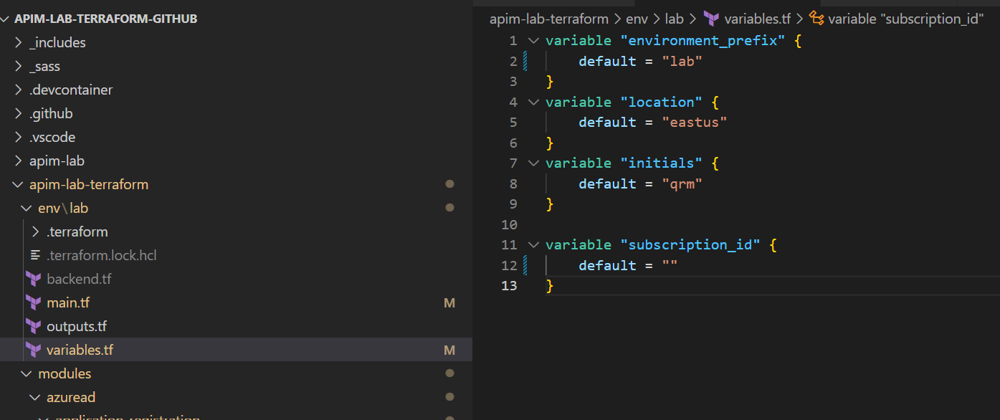
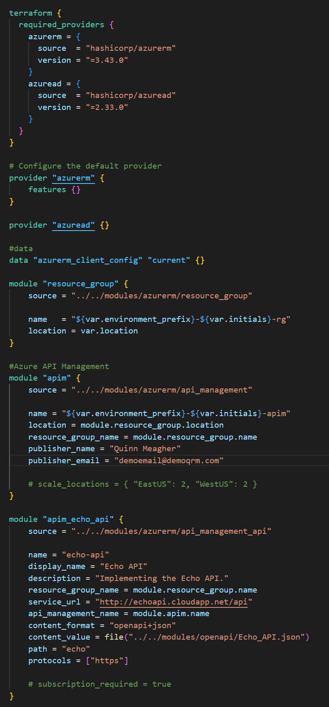
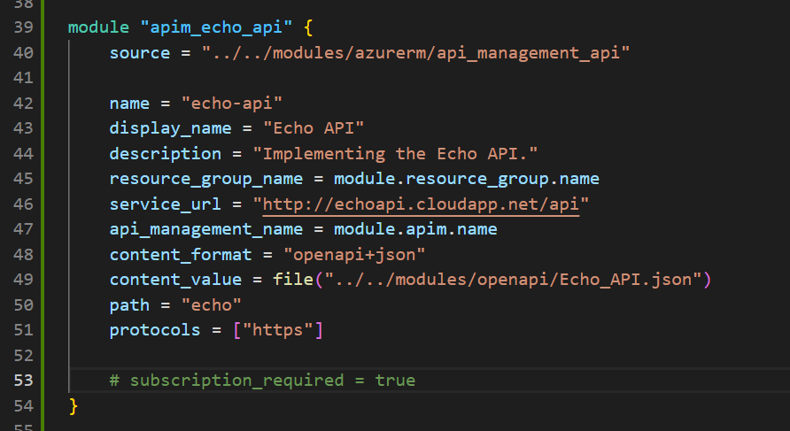

## Create an API Management instance

Due to the substantial infrastructure, an API Management instance can take some time to provision. Expect ~45-75 minutes. Therefore, **please create an instance prior to any demo.**

Using either your own or [Azure's common naming convention](https://docs.microsoft.com/en-us/azure/cloud-adoption-framework/ready/azure-best-practices/resource-naming), fill in each required field and press *Review + Create*, followed by *Create* to provision the service. 

> Please bear in mind that this APIM instance is entirely intended for the purposes of the lab, and the approach is simplified to provide every lab participant a common starting point. To that end, please do not modify any settings beyond the ones we ask for here as it may result in having to recreate the APIM instance later, which is costly with respect to time.

Once started, it is not necessary to remain on this page or in the Azure Portal. If you entered a valid email address, you will receive a provisioning completion email.

Please note that the **service name must be unique**. We recommend to include your initials and numeric date.

> Take note of APIM service name as you will need it for forming URLs in this lab.

Please use the **Developer** tier, which provides [all relevant features at the lowest cost](https://azure.microsoft.com/en-us/pricing/details/api-management/#pricing). 

Please do not modify other settings. Specifically, the *Virtual network* tab should remain as **None**. We will allude to best practices for securing access to APIM later on in this workshop.

## Create an API Management instance with Terraform
Using the provided Terraform lab content, we will first update the root level variables so that resources are created with a user based naming convetion and in the proper region. 

When using Terraform to create an Azure API Management instance, all starter resources must be manually created. These resources are included in thie demonstration. Execute a Terraform Init and Terraform Apply without any additional changes, this will deploy the base resources required for the first Lab Module exercise.

## Verifying the API Management instance

Once the APIM instance has been created, please verify that it functions correctly by following these steps:

1) Navigate to the newly-created APIM instance in the Azure Portal.  
2) Select the *APIs* blade, then select the *Echo API*.   
3) Press the *Test* tab, then select the *GET Retrieve resource* operation.  
4) Press *Send* to issue a simple request.  

  

5) Observe the `200` Success response.  

  

At this time you have successfully verified that APIM is set up!

### Verification Failure (and Path to Success)

You may have noticed the *Request URL* and may be tempted to put it in your browser, issue a CURL statement, etc. If you do, you may see a `401` error and wonder what's happening.

The reason for this the unauthorized access status code is that the *Echo API* requires a subscription key to be set. Whereas tests originating in APIM account for this automatically, external callers cannot (and, naturally, should not).

Back in APIM, switch to the *Settings* tab and uncheck *Subscription required* and press *Save* at the bottom of the page.

> Subscriptions are important and useful, but in this case, we just want to quickly verify the APIM instance is working as intended.

To make this change in Terraform, uncomment the subscription required property in the module "apim_echo_api" in the root main.tf file

Execute a Terraform Init and Terraform Apply with these changes, this will update the Echo API configuration to require a subscription.

Accessing the link in your browser should now show you no error message. In fact, in order to verify the 200, it's easiest to open your Developer Tools (F12), navigate to the *Network* tab, and look at *All* requests to see the 200.

Alternatively, you can issue a verbose (`-v`) CURL command against the *Echo API* and observe the `200` Success: `curl -v https://<your apim instance>.azure-api.net/echo/resource?param1=sample`

