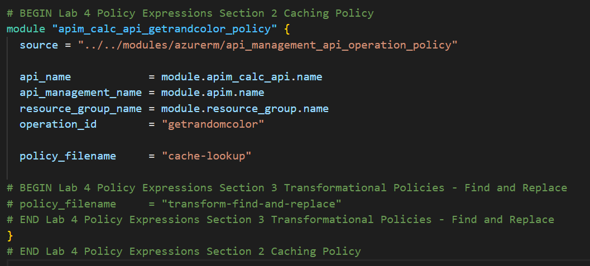

### Caching

API Management can be configured for response caching which can significantly reduce API latency, bandwidth consumption, and web service load for data that does not change frequently.

Using the Azure Management portal, navigate to the *Colors* API and set a set a caching policy for the `Get random color` GET:
  - Press *Add policy*.

    

  - Select *Cache responses*.

    

  - Set a caching duration of `15` seconds.
    > Simple caching configuration is not yet implemented in the Azure Management portal. We shall see later how it can be done using policy expressions.

    

- Configure the Colors website from lab 3 to use the Unlimited subscription URL.
- Select *Start*.
- Notice that for each 15 second period the same color is set.

  

- Looking at the *Get Random color* GET API policies in the *Code View*, you'll see the caching policy defined:

  ```xml
  <policies>
      <inbound>
          <base />
          <cache-lookup vary-by-developer="false" vary-by-developer-groups="false" allow-private-response-caching="false" must-revalidate="false" downstream-caching-type="none" />
      </inbound>
      <backend>
          <base />
      </backend>
      <outbound>
          <base />
          <cache-store duration="15" />
      </outbound>
      <on-error>
          <base />
      </on-error>
  </policies>
  ```

## Caching Policy with Terraform

Policies can also be created using Terraform using the xml policy definition in your resource configuration.

- In the root main.tf file, uncomment the code definitions containing the caching policy. No variables are interpolated for this policy.
  
  Ensure that only the proper section is uncommented using the Lab Section comments.

  
  
- Execute a Terraform Init and Terraform Apply with these changes, this will create the Caching policy for the Colors API.