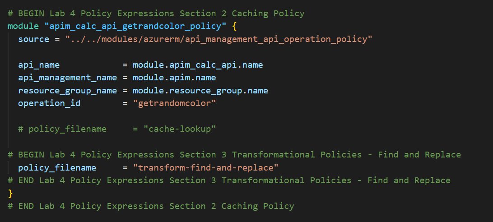
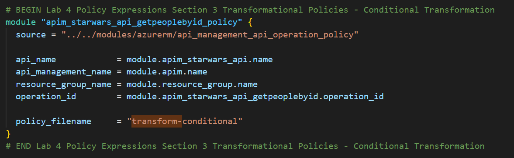
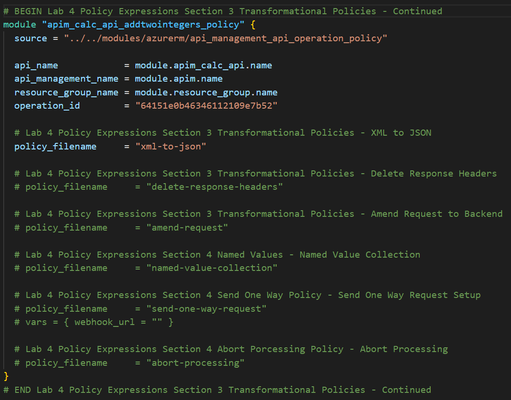
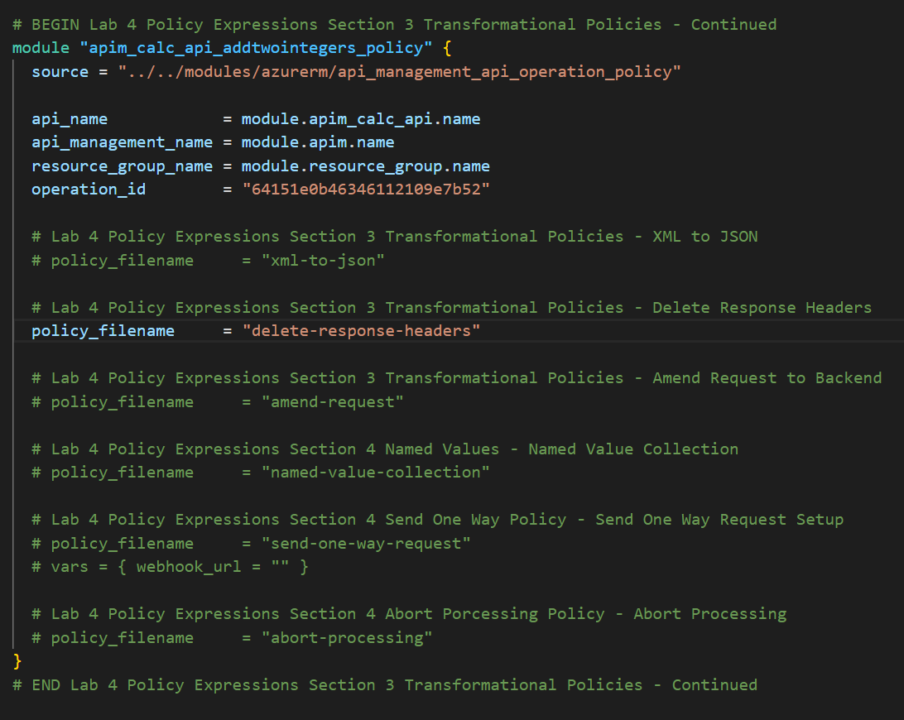
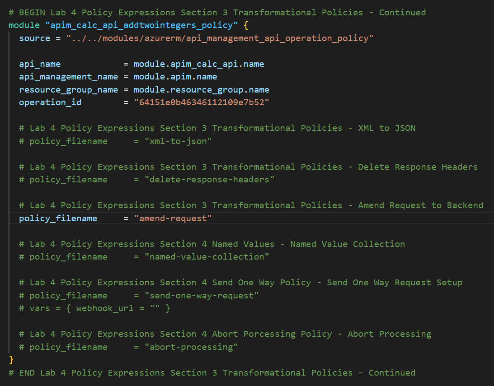

## Colors API 

### Transformation - replace string

The *find-and-replace* policy finds a substring in a request or response and replaces it with a different string.

- Open the *Colors* API, then open the `Get random color` operation.
- Enter the *Policy code editor* in the *Outbound processing* section.
- Place the cursor after the `<base />` element in the `<outbound>` section.
- Press *Show snippets*, then select the *Find and replace string in body* transformation policy.  

  

- Fill in the `from` and `to` values accordingly:

  ```xml  
  <outbound>
      <base />
      <find-and-replace from="blue" to="yellow" />
      <cache-store duration="15" />
  </outbound>
  ```

  

- Save the policy, then invoke the API using the Unlimited subscription key.

  

### Transformation - replace string with Terraform

Policies created using Terraform utilzize a single policy definition in your resource configuration. This means that if you want to add to a policy you would use the same definition as the previous caching policy example.

- In the root main.tf file, uncomment the code definitions containing the find and replace policy file. The policy file configuration for the caching policy can be commented out. No variables are interpolated for this policy.
  
  Ensure that only the proper section is uncommented using the Lab Section comments.

  
  
- Execute a Terraform Init and Terraform Apply with these changes, this will create the Caching policy for the Colors API.

---

## Star Wars API

### Transformation - conditional

Policies can be applied very granularly. In this example, you are modifying the *Star Wars* API to return a limited set of information if the caller is using the *Starter* subscription. Other products, such as the *Unlimited* subscription, will receive the full response.  

The [context variable](https://docs.microsoft.com/en-us/azure/api-management/api-management-policy-expressions#ContextVariables) that is implicitly available in every policy expression provides access to the `Response` and `Product` below. 

- Open the *Star Wars* API, then open the *GetPeopleById* operation.
- Similarly to the *Colors* API, we will add the outbound policy to conditionally change the response body. Replace the existing entries in the operation with the entire `<policies>` code below.  
Note that the inbound `Accept-Encoding` header is set to `deflate` to ensure that the response body is not encoded as that causes the JSON parsing to fail.  

  ```xml
  <policies>
      <inbound>
          <base />
          <set-header name="Accept-Encoding" exists-action="override">
              <value>deflate</value>
          </set-header>
      </inbound>
      <backend>
          <base />
      </backend>
      <outbound>
          <base />
          <choose>
              <when condition="@(context.Response.StatusCode == 200 && context.Product?.Name != "Unlimited")">
                  <set-body>@{
                          var response = context.Response.Body.As<JObject>();

                          foreach (var key in new [] {"hair_color", "skin_color", "eye_color", "gender"}) {
                              response.Property(key).Remove();
                          }

                          return response.ToString();
                      }
                  </set-body>
              </when>
          </choose>
      </outbound>
      <on-error>
          <base />
      </on-error>
  </policies>
  ```

### Transformation - conditional with Terraform

Policies created using Terraform utilzize a single policy definition in your resource configuration. This means that if you want to add to a policy you would use the same definition as the previous caching policy example.

- In the root main.tf file, uncomment the code definitions containing the find and replace policy file. The policy file configuration for the caching policy can be commented out. No variables are interpolated for this policy.
  
  Ensure that only the proper section is uncommented using the Lab Section comments.

  
  
- Execute a Terraform Init and Terraform Apply with these changes, this will create the transformation policy for the Star Wars API operation.

- Test the API on the *Test* tab with *id* 1 and apply the appropriate *Starter* or *Unlimited* product scope. Examine the different responses.

- With *Starter* or *None* product scope:

  

- With *Unlimited* product scope. Notice the four properties in red that are not included in the *Starter* scope response.

  


---

## Calculator API 

### Transformation - XML to JSON

A frequent requirement is to transform content, especially to maintain compatibility with legacy APIs. For this lab we are going back to the *Calculator* API that returned an XML response. 

- Add an outbound policy to the *Add two integers* operation on the *Calculator* API to transform the response body to JSON.

  ```xml
  <outbound>
      <base />
      <xml-to-json kind="direct" apply="always" consider-accept-header="false" />
  </outbound>
  ```

### Transformation - XML to JSON with Terraform
- In the root main.tf file, uncomment the code definition containing the addtwointegers operation policy. No variables are interpolated for this policy.
  
  Ensure that only the proper section is uncommented using the Lab Section comments.

  
  
- Execute a Terraform Init and Terraform Apply with these changes, this will create the XML to JSON policy for the Calc API operation.

- Test the API and examine the response. Note that it's now JSON.

  

### Delete response headers

A frequent requirement is to remove headers, especially ones that return security-related or superfluous information.

- Add an outbound policy to the same *Calculator* API operation to remove specific response headers.

  ```xml
  <outbound>
      <base />
      <xml-to-json kind="direct" apply="always" consider-accept-header="false" />
      <set-header name="x-aspnet-version" exists-action="delete" />
      <set-header name="x-powered-by" exists-action="delete" />
  </outbound>
  ```

### Delete response headers with Terraform
- In the root main.tf file, uncomment the code definition containing the delete-response-headers policy filename. No variables are interpolated for this policy.
  
  Ensure that only the proper section is uncommented using the Lab Section comments.

  
  
- Execute a Terraform Init and Terraform Apply with these changes, this will create the Delete response headers policy for the Calc API operation.

- Invoke the API and examine the response, which now no longer contains the two headers. See above screenshot for how it looked prior.

  

### Amend what's passed to the backend

Query string parameters and headers can be easily modified prior to sending the request on to the backend. 

- Back in the same *Calculator* API operation, add inbound policies to modify the query string and headers. 

  ```xml
  <inbound>
      <base />
      <set-query-parameter name="x-product-name" exists-action="override">
          <value>@(context.Product?.Name ?? "none")</value>
      </set-query-parameter>
      <set-header name="x-request-context-data" exists-action="override">
          <value>@(context.Deployment.Region)</value>
      </set-header>
  </inbound>
  ```

### Amend what's passed to the backend with Terraform
- In the root main.tf file, uncomment the code definition containing the amend-request policy filename. No variables are interpolated for this policy.
  
  Ensure that only the proper section is uncommented using the Lab Section comments.

  
  
- Execute a Terraform Init and Terraform Apply with these changes, this will create the Amend request policy for the Calc API operation.

- Test the call by using either the *Starter* or *Unlimited* product, click on Trace button and then inspect the result on the *Trace* tab. If Tracing is not enabled, press *Enable Tracing*.

  

  