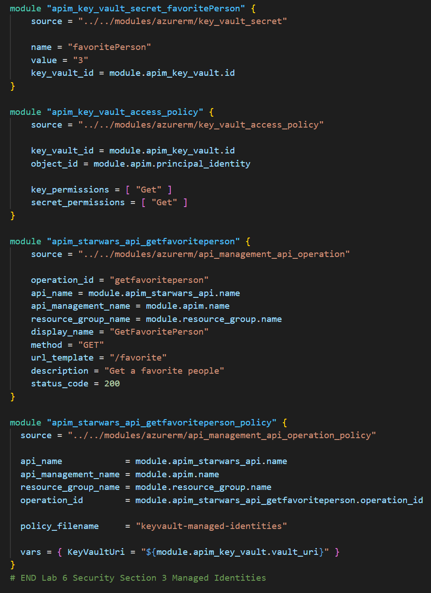

## Security


### Managed Service Identity

In Azure, an Active Directory identity can be assigned to a managed resource such as an Azure Function, App Service or even an API Management instance. Once an identity is assigned, it has many capabilities to work with other resources that leverage Azure AD for authentication, much like a service principal.

#### Register API Management with Active Directory


#### Key Vault - Create Key Vault and add a secret

- Create a Key Vault instance
- Add a [secret](https://docs.microsoft.com/en-us/azure/key-vault/secrets/quick-create-portal#add-a-secret-to-key-vault) to the Key Vault instance
  - Name:`favoritePerson`
  - Value: `3`


#### Key Vault - Access policy and principal assignment

Create an access policy


Select the `Get` operation from the list of Secret permissions


Select the principal and search for the name of your API Management instance


Remember to click **Save**


#### API Management, Key Vault and Managed Service Identity

- Add a new operation to the Star Wars API
- Update the policies for the new operation


```xml
<!-- Inbound -->
<base />
<send-request mode="new" response-variable-name="secretResponse" timeout="20" ignore-error="false">
    <set-url>https://{your-keyvault-base-uri}.azure.net/secrets/favoritePerson/?api-version=7.0</set-url>
    <set-method>GET</set-method>
    <authentication-managed-identity resource="https://vault.azure.net" />
</send-request>
<set-variable name="favoritePersonRequest" value="@{
    var secret = ((IResponse)context.Variables["secretResponse"]).Body.As<JObject>();
    return "/people/" + secret["value"].ToString() + "/";
}" />
<rewrite-uri template="@((string)context.Variables["favoritePersonRequest"])" />
```

### API Management, Key Vault and Managed Service Identity with Terraform
- In the root main.tf file, uncomment the code definitions containing the Azure Key Vault and related APIM resources for the Star Wars API. For this policy we will be interpolating our the KeyVaultUri variable using the vars property. This value is the id from our Key Vault module.
  
  Ensure that only the proper section is uncommented using the Lab Section comments.

  

- Execute a Terraform Init and Terraform Apply with these changes, this will create the Authorization Code Grant policy for all operations within the Calculator API to require a valid token authorized by the backend Application Registration.

#### Test the operation

- Test the operation (use the developer portal, Azure portal or tools like Postman and curl)
- Notice the request URL will be similar to: `https://{your-apim-instance}.azure-api.net/sw/favorite`

